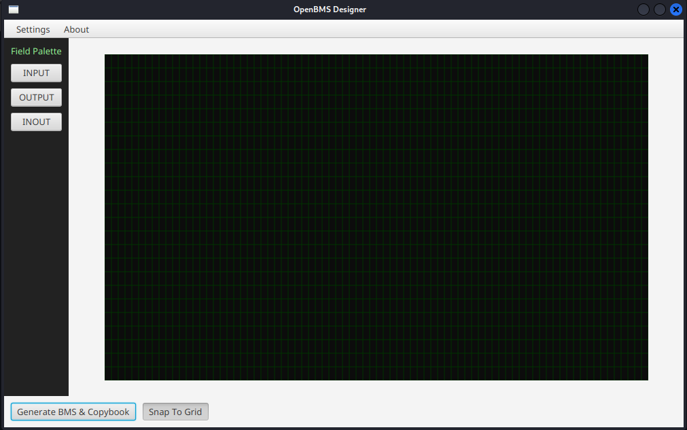
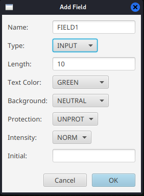
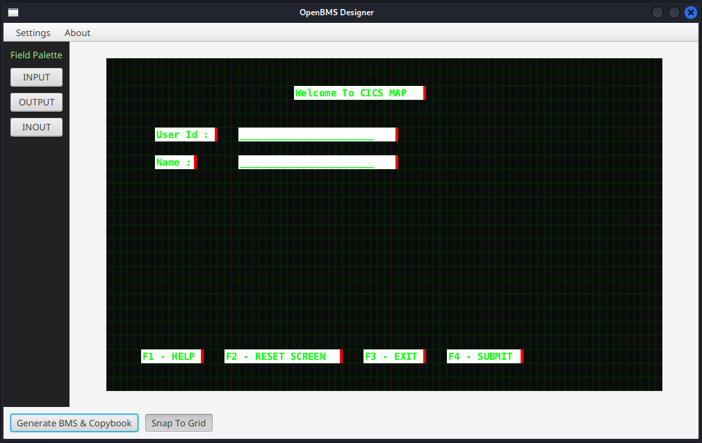
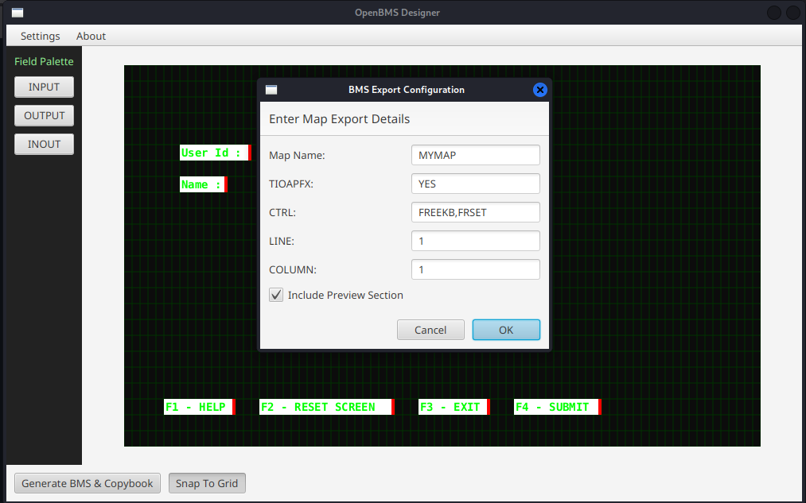
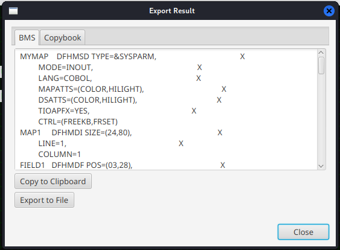
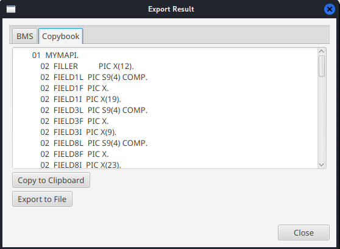
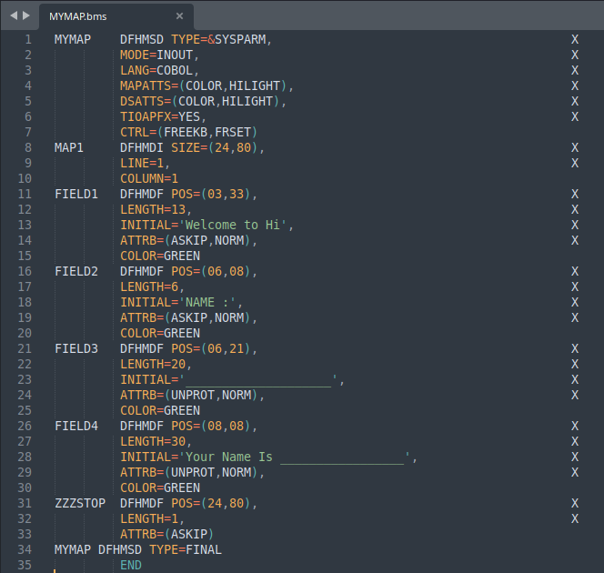
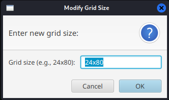
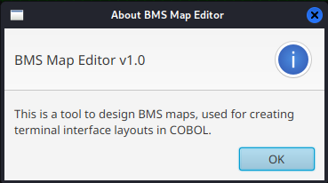

# bms-designer

**BMS Designer for COBOL CICS** built using **Java and OpenJFX** to visually design BMS maps and generate map source code.

This tool helps developers create **CICS BMS screen layouts visually** instead of writing BMS map definitions manually.

---

# Screenshots

### Main Editor

### Field Editor Dialog

### Grid Layout Editor

### Export Configuration

### Map Layout Example

### Copybook Layout Example

### Export File

### Grid Configuration Dialog

### About Dialog

---

# Features

* Visual **terminal grid editor**
* Default **24x80 layout**
* Add **INPUT / OUTPUT / INOUT fields**
* Drag and move fields
* Resize fields
* Field property editor
* Field name validation
* Snap-to-grid positioning
* Keyboard shortcuts
* Copy / Paste fields
* Export generated:

  * **BMS Map**
  * **COBOL Copybook**

---

# Tech Stack

* **Java**
* **OpenJFX (JavaFX)**
* Canvas-based rendering

---

# How It Works

1. Create fields on the terminal grid
2. Configure field attributes
3. Arrange the screen layout visually
4. Generate BMS map and COBOL copybook

The generated output can be used in **CICS COBOL applications**.

---

# Disclaimer

⚠️ **Learning Project**

I am currently **learning CICS and BMS map development**, so this project is mainly built for **practice and experimentation**.

Because of this:

* The generated BMS code **may not cover all edge cases**
* Some **CICS behaviors may not be fully implemented**
* The generated output **may require manual adjustments**

If you find bugs, incorrect BMS generation, or have suggestions, please **open an issue** and let me know.

Feedback and contributions are welcome.

---

# Status

🚧 Work in progress

More improvements and features will be added over time.

---

# License

This project is open source and available under the **MIT License**.
